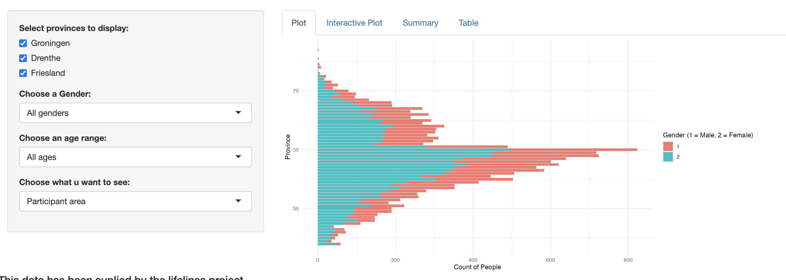
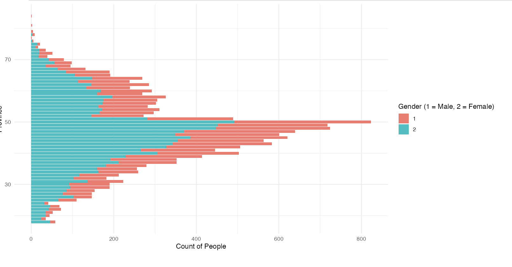
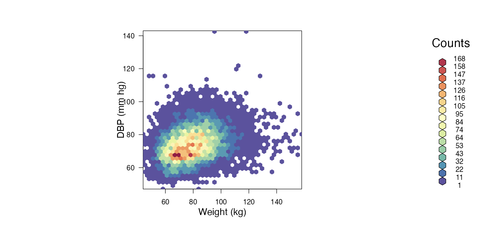
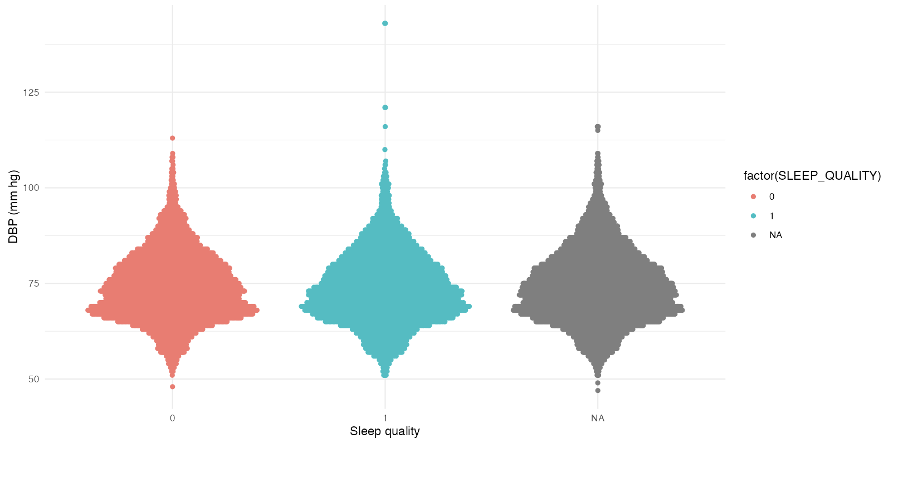

# Datadashboard Lifelines Lifestyles

This project presents an interactive data dashboard based on exploratory data analysis using data from [LifeLines](https://www.lifelines.nl). The dashboard explores correlations between lifestyle factors such as sleep quality and weight, and diastolic blood pressure (DBP). These factors were chosen because they are often manageable through personal lifestyle changes or medical intervention. High blood pressure is a critical health concern due to its role in conditions like atherosclerosis, strokes, and heart attacks.

The dashboard includes three main visualizations: participant distribution, sleep quality, and weight in relation to blood pressure. Users can explore both interactive and non-interactive plots, apply filters for province, gender, and age group, and access additional tabs for explanations, FAQs, and contact information. This functionality enables users to discover insights that could benefit public health understanding.

1.  [Background](#Background)
2.  [#How%20to%20use%20this%20app](#How to use this app)
3.  [Library's](#Library's)
4.  [What%20do%20you%20see?](#What do you see?)
5.  [Authors](#Authors)
6.  [Results](#Results)
7.  [Version%20History](#Version History)
8.  [License](#License)

## Background {#background}

An in-depth paragraph about your project and overview of use.

This project is a datadashboard made using data provided by <https://www.lifelines.nl> this data has been through a Exploratory Data Analysis. The findings that we're found interesting from this analysis have been visualized in a normal plot and an interactive plot that show different lifestyle factors. The lifestyle factors that have been chosen are the sleep quality and weight in correlation to DBP (Diastolic Blood presure). These factors have been chosen because they are two things that can be fixed by people themselfs. A high weight can be fixed for 90% of people with a healthy diet and regular excercise, this meaning that if their bloodpressure is high due to their weight it should be able to be lowered by the previously mentioned solutions. For sleep quality it could be harder to fix but still managable, this could be fixed by going to a doctor (allot of people have undiagnosed sleep apnea) that could give a diagnose of different scala. Or the quality of where someone sleeps need's improvement, this could be the sounds that happen when a person is supossed to sleep, the ammount of blue light a person gets before bed that could mess with their melatonin or other hormones, the quality of the bed and the room could contribute to bad sleep and ofcourse the length of someone's sleep has influence on the sleep cycles that contributes most to quality of sleep. Getting enough rem sleep is essential for optimal function of the body and mind.

So why Diastolic Blood presure? a high blood presure is very dangerous for a multitude of factors. High bloodpresure damages the bloodvessel wall, these damages are microtears in the bloodvessel wall this in turn causes Atherosclerosis (the buildup of fats, cholesterol and other substances in and on the artery walls) due to this the veins will narrow and cause more stress on that spot in the bloodvessel.


Seen in this figure is the progression of atherosclerosis, it will start slow and build up allot of plaque and fats, then there are three options that will occur. critical stenosis can cause a variety of symptoms ranging from lower back pain to weakness in the legs and many other's depending on where the vein is located. Superimposed thrombus is also a possibilty of late stage atherosclerosis, this means a blood cloth will be stuck in the vein causing a blockade that could lead to a stroke when this happens in the brain or a heart attack when in the heart and a variaety of different other complications depending on what area the vein is located. Aneurism/Rupture of the veinwall happens when the cellwall becomes too weak due to excess stress from high blood pressure causing it to rip and blood leaking into your body. This will cause different complications again varying on the location of the vein. some complications could include internal bleeding and a stroke.

### How to use this app

-   R version 4.4.1 (2024-06-14)

#### Library's

Here's how to install the required packages

```{r}
install.packages("package")
```

Or it can be done with Biocmanager

```{r}
BiocManager::install("package")
```

| Package      | Version   | Link                                                            |
|-------------------|-------------------|-----------------------------------|
| shiny        | 1.9.1     | [shiny](https://cran.r-project.org/package=shiny)               |
| dplyr        | 1.1.4     | [dplyr](https://cran.r-project.org/package=dplyr)               |
| psych        | 2.4.6.26  | [psych](https://cran.r-project.org/package=psych)               |
| ggplot2      | 3.5.1     | [ggplot2](https://cran.r-project.org/package=ggplot2)           |
| hexbin       | 1.28.5    | [hexbin](https://cran.r-project.org/package=hexbin)             |
| RColorBrewer | 1.1.3     | [RColorBrewer](https://cran.r-project.org/package=RColorBrewer) |
| ggiraph      | 0.8.12    | [ggiraph](https://cran.r-project.org/package=ggiraph)           |
| DT           | 0.33      | [DT](https://cran.r-project.org/package=DT)                     |
| plotly       | 4.10.4    | [plotly](https://cran.r-project.org/package=plotly)             |
| tmap         | 3.99.9003 | [tmap](https://cran.r-project.org/package=tmap)                 |
| sf           | 1.0.19    | [sf](https://cran.r-project.org/package=sf)                     |

All these versions have been checked on my personal system on 14-01-2025

To run the program the user will have to run the server.R and or ui.R (after installing the required packages) this should be done through an IDE that can run R code, this could be an IDE like Rstudio. Then the program will launch in another window this being a local server on your personal machine that will host the datadashboard. After that the user should be able to interact with the datadashboard without any issues.

#### What do you see?

This datadashboard has 3 different graphs for the user to interact with - The Participant area - The Sleep quality - The Weight and bloodpressure T1

each of these plots have an interactive and non-interactive version. The user can also apply 3 filters, What province should be shown, What gender should be shown and what age group.

This allows the user to look at different variety's of these plots causing them to make their own findings that might be interesting to the public.

There are 4 tabs, the non-interactive graph, interactive graph, explenation for each graph and the datatable.

There is also a page that explains Frequently Asked Questions and a page for contact and info.

### Results



Here is the first thing shown when you run the app. This shows the filtering options, the different tabs with the non-interactive and interactive plot, the summary (text explenation) and the table. The filter area can be changed but show's the standard settings of all provinces, all genders and all ages.

**The graphs**



A barplot (or barchart) is one of the most common types of graphic. It shows the relationship between a numeric and a categoric variable. Each entity of the categoric variable is represented as a bar. The size of the bar represents its numeric value. This barplot shows how many participants there are and i what age range they are. The user can filter this data with the sidebar! The filtering options are: Gender, Age range and Province"

Figure 3 is a barplot that shows



Hexbin chart is a 2d density chart, allowing to visualize the relationship between 2 numeric variables. Scatterplots can get very hard to interpret when displaying large datasets, as points inevitably overplot and can't be individually discerned.



Figure 5 is a quasirandom plot, it is like a violin plot but with points. This plot shows the correlation between good sleep quality being 1 and bloodpressure. Research show's that good sleep is essential to good cardiovascular health, in this plot the difference can be shown in a very light way. There are multiple factors not shown here that can also influence that cardiovascular health. Like weight and age. !! MALE HAD MANY NA'S CAUSING ERROR IN THE PLOT WITH FILTERING!!

## Authors

-   J.J. Duiker - Github: azzipxonraj

## Version History

-   0.1
    -   Initial Release

## License

This project is licensed under the [MIT License](LICENSE).\
Feel free to use, modify, and distribute this project under the terms of the license.

## Acknowledgments
