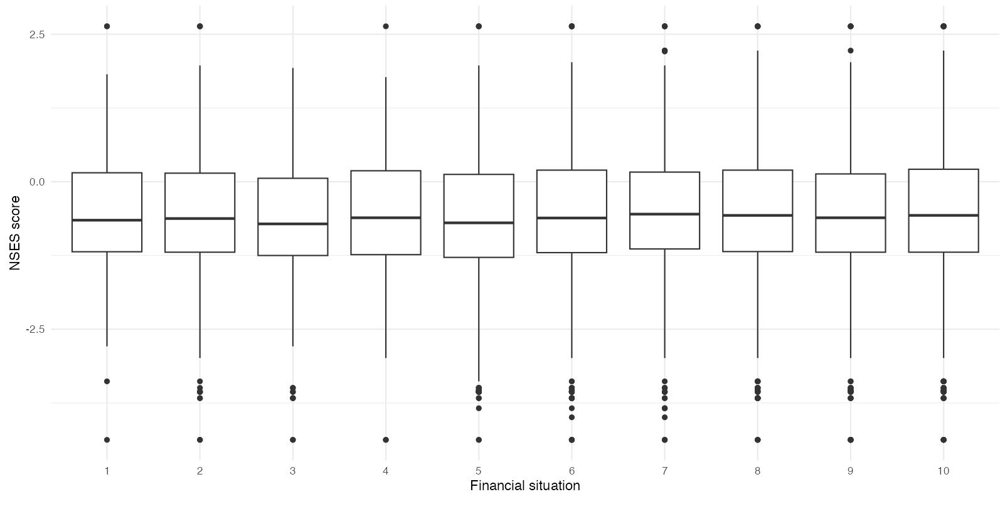
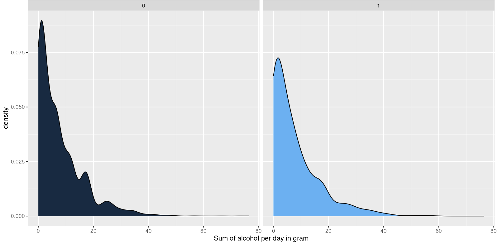
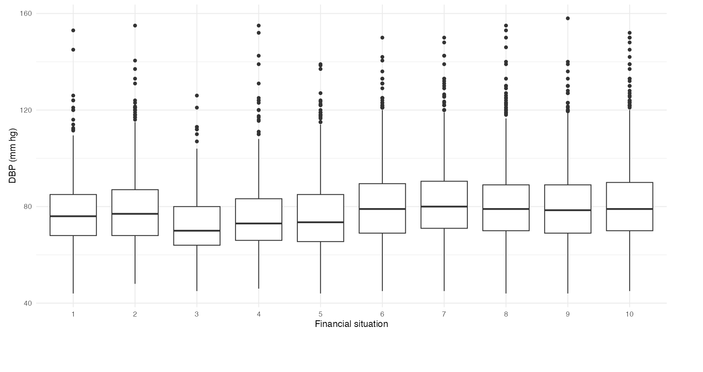
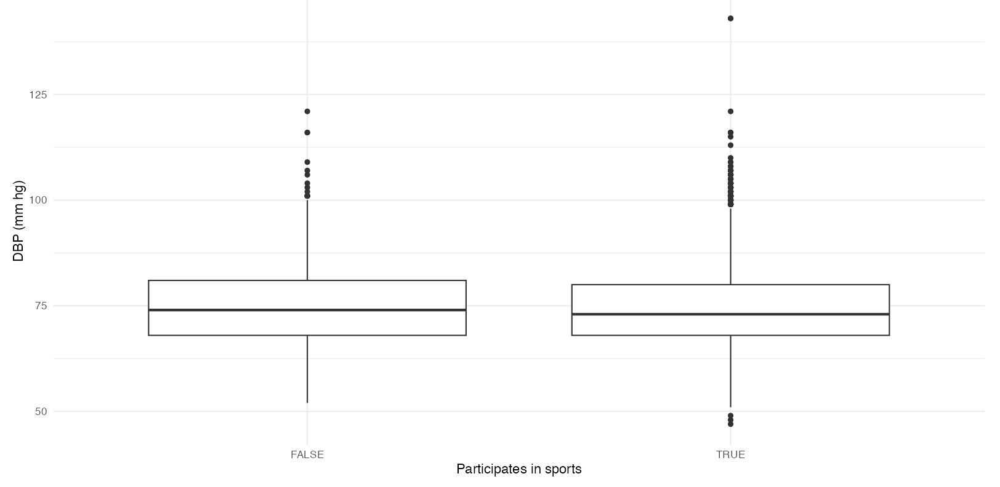
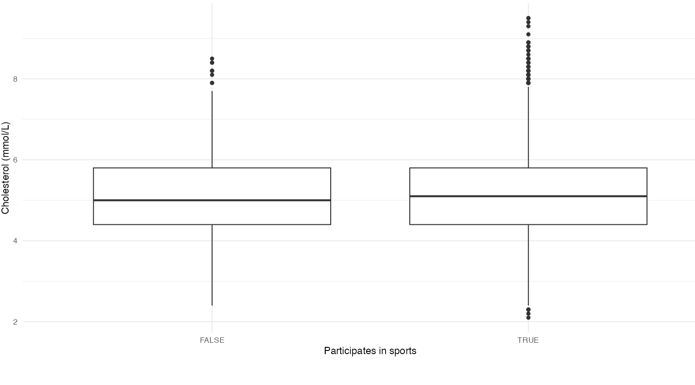
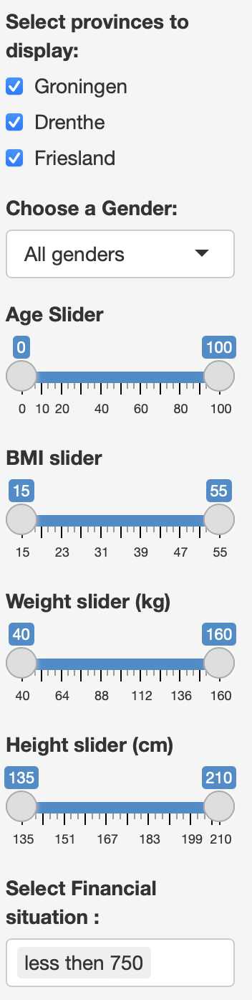
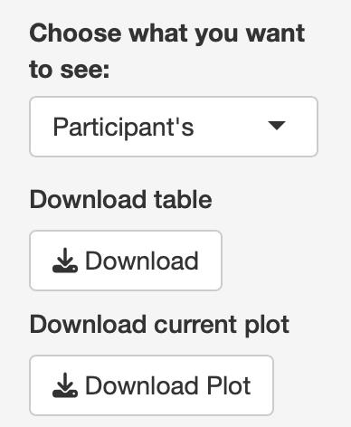

# FAQ

## What are these plots?

**Hexbin**

{width="822"}

A hexbin chart is a 2D density plot that visualizes the relationship between two numeric variables. Scatterplots can become difficult to interpret when displaying large datasets due to overlapping points, making it hard to distinguish individual data points. The hexbin chart overcomes this limitation by grouping data into hexagonal bins and displaying their density. In this project to make the Hexbin more easy to interpret a interactive version has been made besides the static version. This allows the user to hover over each point with their mouse and get the exact number of counts.

The plot contains on the x-axis the Weight for each person in kilograms. the y-axis contains the Diastolic blood pressure in mm hg. The legend gives a counts type but it has a hard time updating with the filter sometimes.

**Barplot**

{width="822"}

Figure 2 is a barplot (or bar chart) it is one of the most common types of graphics. It is used to display the relationship between a categorical and a numeric variable. Each category is represented by a bar, and the size of the bar corresponds to the numeric value it represents. This barplot shows the number of participants within different age ranges. The user can filter the data using the sidebar, with filtering options including gender, age range, and province.

This plot is to show who's participating in this lifelines project. The x-axis show's the ammount of people. The y-axis will show the age. The legend has 2 numbers: 1 = Male and 2 = Female.

**Violin / Quasirandom**

{width="822"}

Figure 3 is a quasirandom plot, similar to a violin plot but with individual data points for added granularity. The plot illustrates the correlation between sleep quality (where good sleep is represented by 1) and blood pressure. Research shows that good sleep is essential for maintaining cardiovascular health. In this plot, the relationship between these factors is subtly visualized. However, it is important to note that there are other factors not included in this plot, such as weight and age, which can also influence cardiovascular health.

The x-axis shows sleep quality, 0 = bad sleep and 1 being good sleep quality

Note: There were many missing values (NA's) in the male dataset, which caused errors during the filtering process. For this reason the NA's have been left in the plot.

{width="800"}

A boxplot effectively summarizes one or more numeric variables by highlighting key statistical features. The box represents the interquartile range (IQR), which spans the middle 50% of the data between the lower (Q1) and upper (Q3) quartiles, with the line inside indicating the median. Whiskers extend from the box to represent the range of values within 1.5 times the IQR beyond Q1 and Q3, excluding outliers. Any values outside this range are marked as outliers, providing a clear visual of the data's spread and central tendency. This plot show's NSES - Neighborhood socio-economic status score according to CBS Statistics Netherlands, based on inhabitants’ educational level, income and job prospective. This means a higher score = a better Neighborhood.

The x-axis is financial situation and the y-axis shows the NSES score.

{width="800"}

Figure 5 shows the distribution of daily alcohol consumption (in grams) for two groups, "0" and "1," using density curves. Both distributions are left-skewed, indicating that most individuals in both groups consume little to no alcohol. Group "0" has a broader distribution with more extreme values, while group "1" shows a sharper peak at low consumption levels and fewer outliers, reflecting differences in alcohol consumption patterns.

People with depression can have destructive behavior that could lead to more alcohol use, therefore this plot can be interesting with the filtering.

{width="800"}

A boxplot effectively summarizes one or more numeric variables by highlighting key statistical features. The box represents the interquartile range (IQR), which spans the middle 50% of the data between the lower (Q1) and upper (Q3) quartiles, with the line inside indicating the median. Whiskers extend from the box to represent the range of values within 1.5 times the IQR beyond Q1 and Q3, excluding outliers. Any values outside this range are marked as outliers, providing a clear visual of the data's spread and central tendency. This plot show's DBP for each financial situation. The DBP is influenced not only by physical health but also mental health, problems like stress and financial hardship can have a big influence too. This is why this plot is very important.

{width="800"}

Figure 7 is a boxplot, A boxplot effectively summarizes one or more numeric variables by highlighting key statistical features. The box represents the interquartile range (IQR), which spans the middle 50% of the data between the lower (Q1) and upper (Q3) quartiles, with the line inside indicating the median. Whiskers extend from the box to represent the range of values within 1.5 times the IQR beyond Q1 and Q3, excluding outliers. Any values outside this range are marked as outliers, providing a clear visual of the data's spread and central tendency.

The x-axis shows TRUE and FALSE, this tells if the participant does sports or not. The y-axis show's diastolic blood pressure in mm hg. Regular physical activity like sports can result in a lower bloodpressure. This will prevent problems and lower the participant chance of getting hypertension.

{width="800"}

Figure 8 is a boxplot, a boxplot effectively summarizes one or more numeric variables by highlighting key statistical features. The box represents the interquartile range (IQR), which spans the middle 50% of the data between the lower (Q1) and upper (Q3) quartiles, with the line inside indicating the median. Whiskers extend from the box to represent the range of values within 1.5 times the IQR beyond Q1 and Q3, excluding outliers. Any values outside this range are marked as outliers, providing a clear visual of the data's spread and central tendency.

Participating in sports is benificial for a person's general health. Keeping your cholesterol in a healthy range will make sure that optimal hormones are made whilest there aren't any negative side effects like problems with the cardiovascular system. Acording to the NHS the total cholesterol should be below 5 mmol/L, and if you've had a heartattack bellow 4 mmol/L would be optimal.

## What are the filter options?

{width="200"}

-   Province selection

    -   Due to the data being collected from 3 different provinces, comparing the plots between these would be very interesting. For this reason the filter option for each province have been added. This has been done with filtering for zip-codes. The way of selecting what provinces should be shown is done with checkboxes. All provinces start being checked and can be unchecked and are then filtered out the plot.

-   Gender selection

    -   The gender of a person can have influence on the outcome of different plots. For example the average weight will be very different for females then for males so by filtering out males the plot could show a very different result. Selecting what gender should be shown is done by selecting the wanted gender from a drop down. This being, All genders, Male or Female.

-   Age slider

    -   The age can have influence on allot of variables like weight, financial situation , sleep quality and much more. Due to this an age slider has been implemented so the user can choose themselfs what age group should be shown. As standard all ages from a min of 0 to a max of 100 years old will be shown this includes all ages from the dataset from lifelines.

-   BMI slider

    -   A person's BMI can have allot of inluence on the general health. Altough someones BMI doesn't say everything, this is because it doesn't make a difrence between muscle and fat. This means a person could have a high BMI but could be in amazing shape. Even though this problem is known BMI is still an important filter (it doesn't have to be used).

-   Height slider

    -   Height can be an important factor to someone's lifestyle, at old age height could be something that can prevent someone from doing sports because of the brittleness in the bones. The height also has influence on someones weight and how much kcal someone should consume each day making it easier to have higher cholesterol.

-   Weight slider

    -   Weight is a very important factor to someone's health, being overweight can cause a multitude of problems from bad joints making someone inable to do sports to cardiovascular problems. combining this slider with the height slider could show some interesting graphs.

-   Financial situation

    -   For the financial situation there are 10 choices, 2 contain people who either didn't know or people who didn't want to say. for the other 8 there is a scale from less then 750 euro a month to more then 3500 a month. All these different salary ranges will be displayed in full with a format like "750-1000". The financial situation that you're in will have allot of impact on what resources you have available. Due to that changing your health or ways of living will be easier most likely when u have more money. It can however also have negative influence on your mental health with stress and burnouts. This is why it is important to have this as a seperate filter.

### Other options

{width="348"}

-   Choose what you want to see

    -   This is the dropdown menu that shows what plots are available, for explenation what each plot contains see figures above.

-   Download table

    -   This button let's the user dowload the data with how they've modified it. it will pop up a save window for the user to give it a name and the file will be saved as a .csv

-   Download plot

    -   This button gives the user the option to download the current plot that is shown with it's filters. This can give the user the option to compare his made plot to someone of another user or the plot's in the readme/FAQ

## **Where does this data come from?**

This data has been suplied by the lifelines project - <https://www.lifelines.nl>

## What is the background info?

This project is a datadashboard made using data provided by <https://www.lifelines.nl> this data has been through a Exploratory Data Analysis. The findings that we're found interesting from this analysis have been visualized in a normal plot and an interactive plot that show different lifestyle factors. The lifestyle factors that have been chosen are the sleep quality, weight, financial situation, participating in sports in correlation to DBP (Diastolic Blood presure). *There are also some other lifestyle factors that have been explored like alcohol and depression but these aren't in correlation with DBP.*These factors have been chosen because they are two things that can be fixed by people themselfs. A high weight can be fixed for 90% of people with a healthy diet and regular excercise, this meaning that if their bloodpressure is high due to their weight it should be able to be lowered by the previously mentioned solutions. For sleep quality it could be harder to fix but still managable, this could be fixed by going to a doctor (allot of people have undiagnosed sleep apnea) that could give a diagnose of different scala. Or the quality of where someone sleeps need's improvement, this could be the sounds that happen when a person is supossed to sleep, the ammount of blue light a person gets before bed that could mess with their melatonin or other hormones, the quality of the bed and the room could contribute to bad sleep and ofcourse the length of someone's sleep has influence on the sleep cycles that contributes most to quality of sleep. Getting enough rem sleep is essential for optimal function of the body and mind.So why Diastolic Blood presure? a high blood presure is very dangerous for a multitude of factors. High bloodpresure damages the bloodvessel wall, these damages are microtears in the bloodvessel wall this in turn causes Atherosclerosis (the buildup of fats, cholesterol and other substances in and on the artery walls) due to this the veins will narrow and cause more stress on that spot in the bloodvessel.

{width="800"}

Seen in this figure is the progression of atherosclerosis, it will start slow and build up allot of plaque and fats, then there are three options that will occur. critical stenosis can cause a variety of symptoms ranging from lower back pain to weakness in the legs and many other's depending on where the vein is located. Superimposed thrombus is also a possibilty of late stage atherosclerosis, this means a blood cloth will be stuck in the vein causing a blockade that could lead to a stroke when this happens in the brain or a heart attack when in the heart and a variaety of different other complications depending on what area the vein is located. Aneurism/Rupture of the veinwall happens when the cellwall becomes too weak due to excess stress from high blood pressure causing it to rip and blood leaking into your body. This will cause different complications again varying on the location of the vein. some complications could include internal bleeding and a stroke.

## Contact

##### *Any questions that remain unawnsered can be asked on github to user azzipxonraj*
