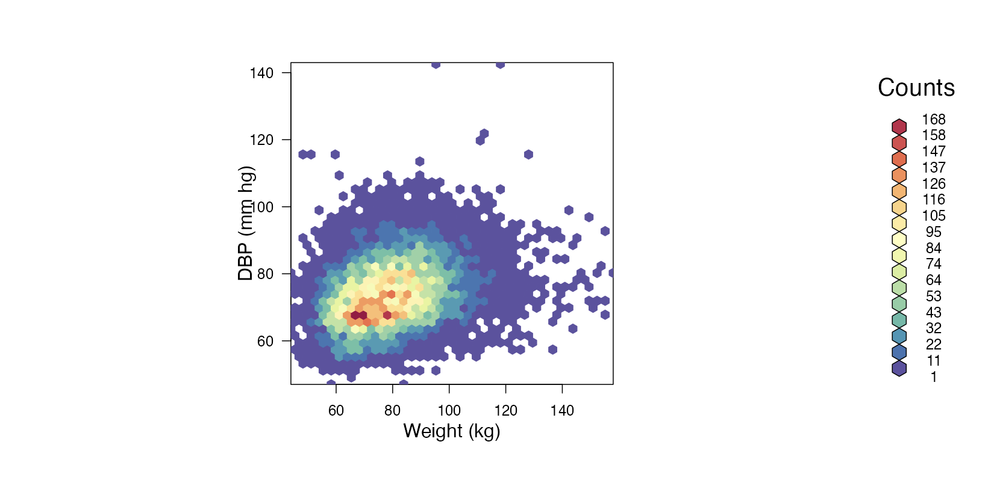
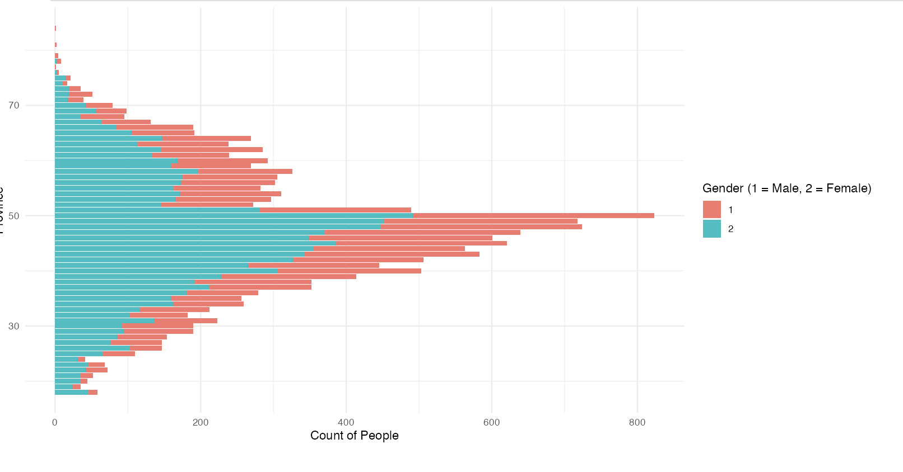
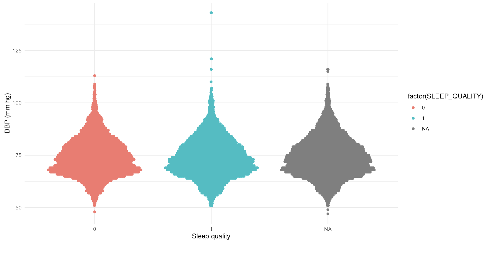

# FAQ

##### *Any questions that remain unawnsered can be asked on github to user azzipxonraj*

What plots have been used?

There are 3 plots being used:

-   Hexbin

-   Barplot

-   Quasirandom / Violin

The plots each show's their data in a different way.

**Hexbin**



A hexbin chart is a 2D density plot that visualizes the relationship between two numeric variables. Scatterplots can become difficult to interpret when displaying large datasets due to overlapping points, making it hard to distinguish individual data points. The hexbin chart overcomes this limitation by grouping data into hexagonal bins and displaying their density. In this project to make the Hexbin more easy to interpret a interactive version has been made besides the static version. This allows the user to hover over each point with their mouse and get the exact number of counts.

**Barplot**



A barplot (or bar chart) is one of the most common types of graphics. It is used to display the relationship between a categorical and a numeric variable. Each category is represented by a bar, and the size of the bar corresponds to the numeric value it represents. This barplot shows the number of participants within different age ranges. The user can filter the data using the sidebar, with filtering options including gender, age range, and province.

**Violin / Quasirandom**



This is a quasirandom plot, similar to a violin plot but with individual data points for added granularity.
The plot illustrates the correlation between sleep quality (where good sleep is represented by 1) and blood pressure. Research shows that good sleep is essential for maintaining cardiovascular health. In this plot, the relationship between these factors is subtly visualized. However, it is important to note that there are other factors not included in this plot, such as weight and age, which can also influence cardiovascular health. Note: There were many missing values (NA's) in the male dataset, which caused errors during the filtering process.

**What provinces has this data been collected from**

```{r auto-run, eval=TRUE, echo=FALSE}
    
library(tmap)
library(dplyr)
library(rnaturalearth)

netherlands <- rnaturalearth::ne_states(country = "Netherlands", returnclass = "sf")

selected_provinces <- netherlands %>%
    filter(name %in% c("Groningen", "Friesland", "Drenthe"))

tm_shape(selected_provinces) +
    tm_polygons(col = "name", title = "Province", border.col = "black") +
    tm_borders()

```

**Where does this data come from?**

This data has been suplied by the lifelines project - <https://www.lifelines.nl>
